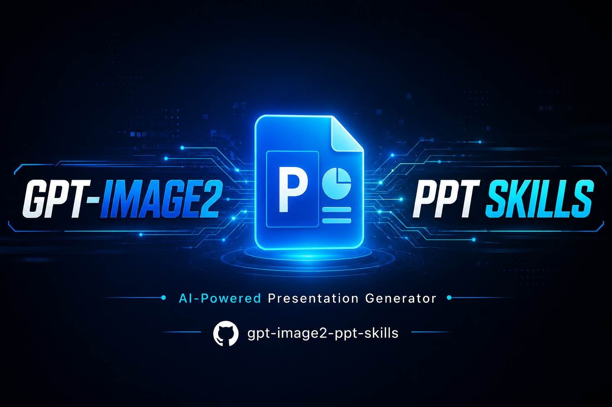
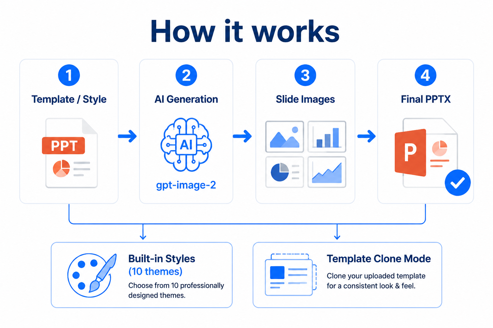

<p align="center">
  
</p>

<h1 align="center">gpt-image2-ppt-skills</h1>

<p align="center">
  基于 OpenAI gpt-image-2 的 AI PPT 生成工具 —— Claude Code / Codex Skill
</p>

<p align="center">
  <a href="#功能特性">功能特性</a> •
  <a href="#快速开始">快速开始</a> •
  <a href="#使用方式">使用方式</a> •
  <a href="#内置风格">内置风格</a> •
  <a href="#模板克隆">模板克隆</a> •
  <a href="#可编辑pptx">可编辑PPTX</a> •
  <a href="#配置说明">配置说明</a>
</p>

---

## 功能特性

<p align="center">
  
</p>

- **10 套内置视觉风格** —— 从科技蓝到手绘风，覆盖商务、技术、创意等场景
- **模板克隆模式** —— 上传 .pptx 模板，AI 自动仿照其风格生成新页面
- **图片编辑模式** —— 基于模板页 PNG 直接编辑替换文字，保持原有布局不变（`/v1/images/edits`）
- **可编辑 PPTX 输出** —— OCR 识别 + LAMA 背景修复，生成可直接编辑文字的 PPTX
- **HTML Viewer** —— 自带键盘翻页、空格自动播放的 HTML 预览
- **多端点自动适配** —— 自动检测中转站能力（edits / generations / chat），智能回退
- **Claude Code & Codex 原生支持** —— 作为 Skill 安装即用

## 快速开始

### 1. 安装

```bash
# Claude Code
git clone git@github.com:luoqianyi/gpt-image2-ppt-skiils.git
cd gpt-image2-ppt-skiils
bash install_as_skill.sh --target claude

# Codex
bash install_as_skill.sh --target codex
```

### 2. 配置 API

编辑 `~/.claude/skills/gpt-image2-ppt-skills/.env`：

```bash
OPENAI_BASE_URL=https://api.openai.com    # 或任意 OpenAI 兼容中转站
OPENAI_API_KEY=sk-...
GPT_IMAGE_MODEL_NAME=gpt-image-2
GPT_IMAGE_QUALITY=high
GPT_IMAGE_ENDPOINT=auto                    # auto | edits | images | chat
```

### 3. 使用

在 Claude Code 中直接说：

```
帮我做一份关于xxx的PPT
用 dark-aurora 风格生成一份技术分享PPT
按这个模板生成PPT（附上 .pptx 文件）
```

## 使用方式

### 内置风格生成

1. 编写 `slides_plan.md` 大纲
2. 转换：`python3 scripts/md_to_plan.py slides_plan.md -o slides_plan.json`
3. 生成：`python3 scripts/generate_ppt.py --plan slides_plan.json --style styles/dark-aurora.md`
4. 产物在 `outputs/<timestamp>/` 目录

### 模板克隆生成

```bash
# 渲染模板为 PNG（需要 LibreOffice 或 Docker）
python3 scripts/render_template.py your-template.pptx

# 基于模板生成
python3 scripts/generate_ppt.py \
  --plan slides_plan.json \
  --template-pptx your-template.pptx \
  --template-images template_renders/your_template \
  --template-strict
```

### 可编辑 PPTX

```bash
# 安装 OCR + 修复依赖
git clone https://github.com/JadeLiu-tech/px-image2pptx.git
pip install -e px-image2pptx[ocr,inpaint]

# 转换（含 LAMA 背景修复）
python3 scripts/editable_pptx.py \
  --images-dir outputs/<timestamp>/images \
  --title "My Presentation"

# 快速模式（跳过修复）
python3 scripts/editable_pptx.py \
  --images-dir outputs/<timestamp>/images \
  --skip-inpaint
```

## 内置风格

| 风格 ID | 定位 | 适用场景 |
| --- | --- | --- |
| `gradient-glass` | Apple Vision OS / 空间玻璃 | AI 产品发布、技术分享 |
| `clean-tech-blue` | Stripe / Linear 蓝白 | 融资路演、商业计划书 |
| `vector-illustration` | 复古矢量插画 | 教育培训、品牌故事 |
| `editorial-mono` | Kinfolk 编辑设计 | 品牌发布、文化讲座 |
| `dark-aurora` | Linear / Vercel 深色霓虹 | AI 产品、开发者工具 |
| `risograph` | Riso 双套色印刷 | 创意工作室、独立 zine |
| `japanese-wabi` | 无印 / 原研哉式侘寂 | 生活方式、奢侈品 |
| `swiss-grid` | Bauhaus 国际主义网格 | 学术报告、严肃汇报 |
| `hand-sketch` | 白板手绘 Sketchnote | 工作坊、brainstorming |
| `y2k-chrome` | Y2K 千禧液态金属 | 潮牌、Z 世代营销 |

## 模板克隆

上传你的 .pptx 模板文件，Skill 会：

1. 用 LibreOffice / Docker 将模板渲染为每页 PNG
2. 分析模板的视觉风格（配色、字体、布局）
3. 基于模板风格 + 你的内容生成新页面

**图片编辑模式**：使用 `/v1/images/edits` 端点直接编辑模板页图片，保持原有布局和装饰元素，只替换文字内容。这是模板克隆的最佳方式。

> 多模态 Agent（Claude Code / Codex）可以直接读取模板 PNG 分析风格，无需配置 VISION_* 环境变量。

## 配置说明

### API 端点选择（GPT_IMAGE_ENDPOINT）

| 值 | 行为 | 适用场景 |
| --- | --- | --- |
| `auto`（默认） | 有参考图时 edits→chat 回退；无参考图时 images→chat 回退 | 推荐，自动适配 |
| `edits` | 强制 `/v1/images/edits` | 中转站明确支持 edits |
| `images` | 强制 `/v1/images/generations` | 无需参考图时 |
| `chat` | 强制 `/v1/chat/completions` | 兼容性最好 |

### 中转站兼容性

不同 OpenAI 兼容中转站对各端点的支持不同：

- `/v1/images/edits` —— 真正的图片编辑，部分中转站不支持或返回原图
- `/v1/images/generations` —— 兼容性最好，几乎所有中转站都支持
- `/v1/chat/completions` —— 多模态对话方式，stream 返回图片

如果发现 edits 端点不生效，设置 `GPT_IMAGE_ENDPOINT=chat` 即可。

## 文件结构

```
gpt-image2-ppt-skills/
├── SKILL.md                    # Skill 入口文档
├── scripts/
│   ├── generate_ppt.py         # 主入口
│   ├── md_to_plan.py           # Markdown → JSON 转换
│   ├── image_generator.py      # gpt-image-2 生成器（支持 edits/generations/chat）
│   ├── template_analyzer.py    # 模板风格分析
│   ├── render_template.py      # PPTX → PNG 渲染
│   ├── editable_pptx.py        # 可编辑 PPTX 转换
│   └── codex_backend.py        # Codex CLI 出图后端
├── styles/                     # 10 套内置风格
├── templates/viewer.html       # HTML 预览模板
├── docs/images/                # 文档图片
├── .env.example                # 环境变量模板
└── requirements.txt            # Python 依赖
```

## 运行时目录

```
<your-project>/
├── template_renders/<stem>/    # 模板渲染 PNG（长期缓存）
├── template_cache/<hash>.json  # 风格分析缓存
└── outputs/<timestamp>/        # 生成产物
    ├── images/slide-*.png
    ├── index.html
    ├── prompts.json
    └── <title>.pptx
```

## License

Apache License 2.0
